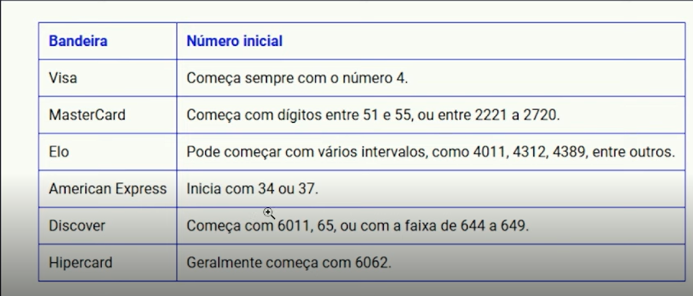

# Validador de Bandeiras de Cartão de Crédito

Este projeto implementa um validador de bandeiras de cartão de crédito em JavaScript. Ele utiliza o **algoritmo de Luhn** para verificar a validade do número do cartão e identifica a bandeira correspondente com base nos padrões de números iniciais.

## Funcionalidades

- **Validação do número do cartão**: Implementação do algoritmo de Luhn para verificar se o número do cartão é válido.
- **Identificação de bandeiras**: Suporte para as seguintes bandeiras:
  - Visa
  - MasterCard
  - Elo
  - American Express
  - Discover
  - Hipercard
  - JCB
  - Diners Club
  - EnRoute
  - Voyage
  - Aura

## Padrões de Bandeiras

Os padrões de números iniciais utilizados para identificar as bandeiras estão descritos na tabela abaixo:

## Estrutura do Código

### Função `validarBandeiraCartao`

Esta função recebe o número do cartão como entrada, valida-o utilizando o algoritmo de Luhn e identifica a bandeira correspondente com base em expressões regulares.

